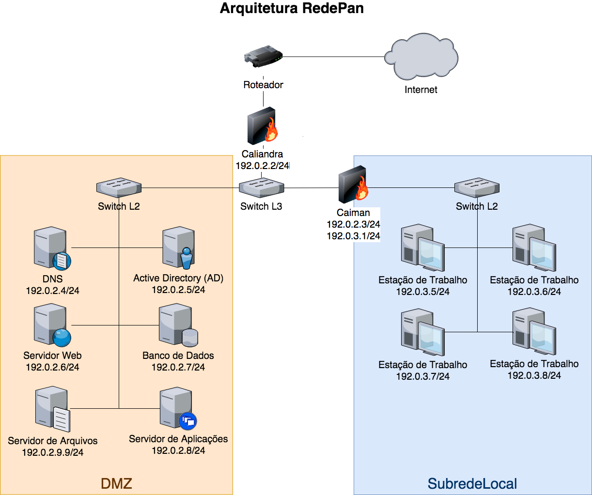

# Atividade: Firewall

Utilize o Docker para criar três contêineres em uma distribuição Linux de sua preferência:
1. **Caliandra**: Este contêiner atuará como o firewall externo e gateway da rede. Ele será configurado para filtrar e gerenciar o tráfego entre a rede interna e a Internet.
2. **Caiman**: Este contêiner funcionará como um firewall para uma subrede interna, protegendo e gerenciando o acesso às estações de trabalho internas.
3. **Estação de Trabalho**: Um contêiner que simula uma estação de trabalho interna, configurada para acessar a Internet e serviços internos através dos firewalls.

A Figura abaixo  representa a arquitetura da rede proposta:

## Configuração da Rede Docker
1. **Rede Externa (RedePan)**:
   - Crie uma rede Docker bridge chamada `RedePan` com o endereço `192.0.2.0/24`.
   - Atribua ao contêiner Caliandra um IP estático de `192.0.2.2/24` para a interface conectada a esta rede.
   
2. **Subrede Interna (SubredeLocal)**:
   - Crie uma segunda rede Docker bridge chamada `SubredeLocal` com o endereço `192.0.3.0/24`.
   - Atribua ao contêiner Caiman um IP estático de `192.0.3.2/24` para a interface conectada a esta subrede.
   - Configure a estação de trabalho para usar o IP `192.0.3.5/24` e utilizar Caiman como gateway.

## Conjunto de Regras de Firewall 
## Regras para Caliandra (Firewall Externo)

1. **Regras Básicas**:
   - Permitir todo o tráfego de saída para a Internet.
   - Bloquear todo o tráfego de entrada da Internet que não seja uma resposta a solicitações iniciadas internamente.

2. **Regras Específicas**:
   - Permitir conexões HTTP e HTTPS de **entrada** da RedePan para a Internet (portas 80 e 443).
   - Permitir conexões DNS de **entrada** e saída (porta 53).
   - Permitir tráfego SMTP e IMAP de **entrada** para e-mail (portas 465, 587,  995, 143, 993).
   - Restringir o acesso ao banco de dados. Somente o servidor de Aplicações pode acessar o banco de dados postgresql (porta 5432)
   - Restringir o acesso ao Servidor de Aplicações à `SubredeLocal`

4. **Logging**:
   - Registrar tentativas de conexões bloqueadas para análise e monitoramento de segurança.

## Regras para Caiman (Firewall da Subrede Interna)

1. **Regras Básicas**:
   - Permitir todo o tráfego entre a rede local e a DMZ.
   - Bloquear qualquer acesso direto da Internet para a estação de trabalho.

2. **Regras Específicas**:
   - Permitir conexões de saída da estação de trabalho para a Internet para HTTP, HTTPS (portas 80 e 443).
   - Permitir tráfego de saída para serviços de e-mail (SMTP, IMAP, POP nas portas 465, 587, 995, 143, 993).
   - Restringir o acesso ao banco de dados. Somente o servidor de Aplicações pode acessar o banco de dados postgresql (porta 5432).
   - Restringir o acesso às portas 80 e 443 da `SubredeLocal`.
   - Restringir o acesso ao Servidor de Aplicações à `SubredeLocal`

3. **Redirecionamento e Encaminhamento**:
   - Configurar encaminhamento de pacotes entre as interfaces de rede para permitir comunicação adequada entre a SubredeLocal e a RedePan, sob supervisão de regras de segurança.

## Implementação
- Utilize um Dockerfile para configurar cada contêiner com as dependências necessárias e as configurações de rede.
- Escreva um script `docker-compose.yml` para definir e iniciar todos os contêineres e redes com as configurações apropriadas.
- Inclua instruções para testar a comunicação entre a estação de trabalho e a Internet, e entre as subredes, verificando a eficácia das regras de firewall.

## Procedimento de Configuração e Teste

- Implemente as regras usando `iptables` dentro dos contêineres.
- Teste a conectividade e o bloqueio adequado, acessando recursos permitidos e verificando a negação de acesso a serviços não autorizados.
- Utilize ferramentas como `curl` e `ping` para testar a conectividade de rede e `traceroute` para validar as rotas de pacotes.

## Avaliação
- Verifique a configuração IP de cada contêiner.
- Teste as rotas de pacotes e as regras de firewall implementadas.
- Avalie o entendimento dos alunos sobre o encaminhamento de pacotes e a aplicação de regras de firewall em um ambiente de contêiner.

## Entregáveis
- Você deverá entregar um PDF contendo as regras de firewall. 
